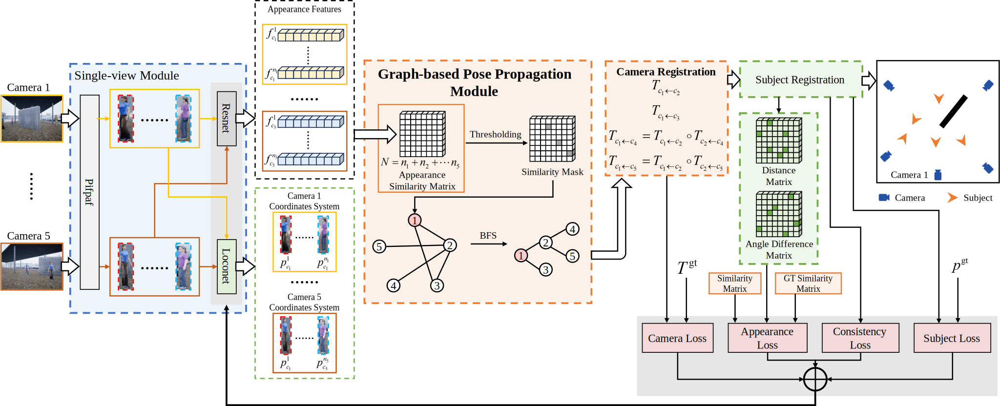

# GO-MVF
The official implementation of "A Graph-Optimised Framework for Calibration-Free Multi-View Fusion in Occluded Scenes".

## Abstract
Multi-view pedestrian detection is crucial for robust scene understanding in applications like surveillance and autonomous driving. 
However, prevailing methods typically depend on precisely pre-calibrated cameras and assume high visual overlap between views, 
causing performance to degrade under occlusions or limited co-visibility. To overcome these constraints, we introduce an end-to-end, 
calibration-free framework for the joint registration of cameras and subjects. Our approach begins with a single-view module 
that estimates pedestrian poses and appearance features within each camera's local coordinate system. 
Subsequently, a novel Graph-based Pose Propagation Module (GPPM) treats cameras as nodes in a graph, connecting them with 
edges when they share co-visible pedestrians identified via appearance matching. A Breadth-First Search (BFS) algorithm then 
finds the shortest registration path from any camera to a designated root camera, enabling pose propagation via local co-visibility 
links and global alignment of all subjects into a unified Bird's-Eye-View (BEV) space. This strategy relaxes the stringent 
requirement of full co-visibility with the root node. A multi-task loss function jointly optimises pose estimation and 
feature matching. Trained and evaluated on a synthetic five-view dataset with occlusions (CSRD-O), our framework achieves 
mean camera pose errors of 1.57 m / 8.70° and mean pedestrian pose errors of 1.40 m / 9.14°. Experiments demonstrate 
the method's robustness in generating accurate BEV pedestrian distributions even under heavy occlusion and low inter-view 
overlap. This work presents a practical, purely vision-based solution for dynamic multi-camera systems, advancing 
the state of calibration-free multi-view fusion.
<figure>
  
</figure>


## Installation
1. Install python 3.7.11 by conda
2. Install pytorch (1.8.1) and torchvision (0.9.1)
```shell
   pip install torch==1.8.1+cu111 torchvision==0.9.1+cu111 torchaudio==0.8.1 -f https://download.pytorch.org/whl/torch_stable.html
```
3. Install other packages, there may be package conflicts, which can be ignored.
```shell
  pip install openpifpaf==0.12.12
  pip install -r requirements.txt
```

## Dataset and Models

Our folder structure follows

```
test_mvf_CSRD_O.py # test code for CSRD-O
test_mvf_CSRD.py # test code for CSRD
train_mvf_CSRD.py # train code for CSRD
├── config
├── dataset 
├── models
    ├── CSRD_O_test.pth # loconet and reid network checkpoints for CSRD-O 
    ├── CSRD_test.pth # loconet and reid network checkpoints for CSRD 
    ├── pretrained_loconet_CSRD.pth # pretrained loconet training on CSRD 
    ├── pretrained_resnet.pth.tar # pretrained resnet for training on CSRD 
    ├── sector_cache_torch_45_thread.pth # patterns for drawing figures in the code
├── nets
├── reid
├── utils
├── data
    ├── CSRD_O
        ├── log
        ├── annotation
            ├── person1.txt # 3d gt of subjects
            ├── ...
            ├── person5.txt
            ├── camera1.txt # 3d gt of cameras
            ├── ...
            ├── camera5.txt
            ├── fp.pth # f_pid_dict[f"{frame_id}_{p_id}"] = [x, y, r]
            ├── fps.pth # f_pids_dict[int(frame_id)][int(p_id)] = [x, y, r]
            ├── fv.pth # fv_dict[f"{frame}_{view_id}"].append([pid, bbox])
            ├── fv_sk_box.pth # fv_sk_box[f"{frame_id}_{view_id}"] = [keypoints, boxes]
            ├── f_top_bbox_pid.pth # not use
        ├── original_img_backup # images of the dataset
            ├── hor1_video 
            ├── hor2_video
            ├── hor3_video
            ├── hor4_video
            ├── hor5_video
    ├── CSRD
        ├── virtual
            ├── log
            ├── annotation
                ├── person1.txt # 3d gt of subjects
                ├── ...
                ├── person20.txt
                ├── camera1.txt # 3d gt of cameras
                ├── ...
                ├── camera5.txt
                ├── init_inf.txt # Starting from the third line, each line represents the number of objects in a frame
                ├── fp.pth # f_pid_dict[f"{frame_id}_{p_id}"] = [x, y, r]
                ├── fps.pth # f_pids_dict[int(frame_id)][int(p_id)] = [x, y, r]
                ├── fv.pth # fv_dict[f"{frame}_{view_id}"].append([pid, bbox])
                ├── fvp.pth # fvp_dict[f"{frame}_{view_id}_{pid}"] = bbox
                ├── fvskwh.pth # fv_sk_wh[f"{frame_id}_{view_id}"] = [keypoints([17 * 3], from pifpaf), wh]
                ├── fv_sk_box.pth # fv_sk_box[f"{frame_id}_{view_id}"] = [keypoints, boxes]
                ├── f_top_bbox_pid.pth # not use
            ├── top_bbox
            ├── hor1_bbox # subject mask images
            ├── ...
            ├── hor5_bbox
            ├── original_img_backup # images of the dataset
                ├── combine # visualization
                ├── hor1_video 
                ├── hor2_video
                ├── hor3_video
                ├── hor4_video
                ├── hor5_video
```


## Getting Started
### Prepare Dataset and Models

1. Prepare the dataset **CSRD-O** [(Baidu Netdisk)](https://pan.baidu.com/s/1l9vIiWI69zPlmTwJUEVu8w?pwd=yc68) [(Huggingface)](https://huggingface.co/datasets/shanpa/CSRD-O/tree/main) or **CSRD-OR**[(Baidu Netdisk)]() [(Huggingface)]() or **CSRD** [(BEVSee)](https://github.com/zekunqian/bevsee) and place it to `./data` as the project structure mentioned above. 
2. Prepare the **models**  [(Baidu Netdisk)](https://pan.baidu.com/s/1ahLSoqlHyfKlmoOu2SF8vQ?pwd=qhu3) [(Huggingface)](https://huggingface.co/shanpa/GO-MVF/tree/main)and place it to `./models` as the project structure mentioned above.

The CSRD-O and CSRD-OR dataset release contains only subset, provided solely for testing the method presented in our paper.
The full dataset and training code will be made available upon request to the authors after the paper is accepted.

### Test
```shell
    python test_mvf_CSRD_O.py
```
```shell
    python test_mvf_CSRD.py
```
### Train
```shell
    python train_mvf_CSRD.py
```
